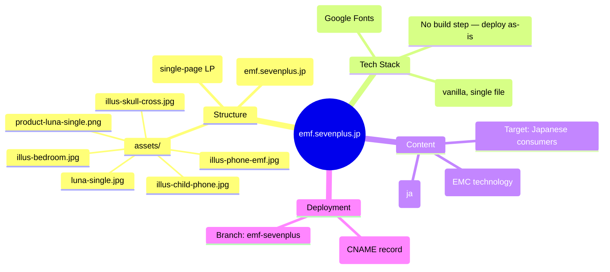

# Architecture — emf-sevenplus

```mermaid
mindmap
  root((emf.sevenplus.jp))
    Structure
      index.html (single-page LP)
      CNAME (emf.sevenplus.jp)
      assets/
        illus-bedroom.jpg
        illus-child-phone.jpg
        illus-phone-emf.jpg
        illus-skull-cross.jpg
        luna-single.jpg
        product-luna-single.png
    Tech Stack
      HTML/CSS/JS (vanilla, single file)
      Noto Serif JP + Noto Sans JP (Google Fonts)
      No build step — deploy as-is
    Content
      EMF exposure report 2026 (ja)
      Product: Luna Single (EMC technology)
      Target: Japanese consumers
    Deployment
      GitHub Pages (CNAME record)
      Branch: emf-sevenplus
```
